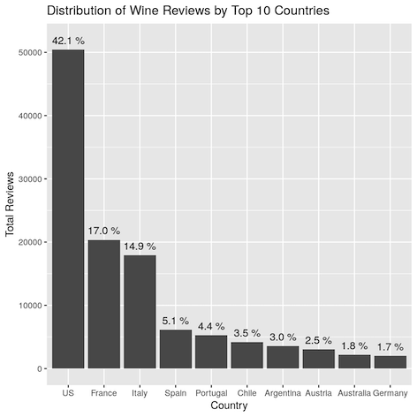
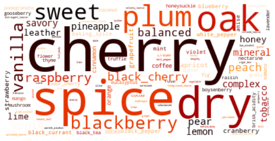

# Wine_capstone
Lighthouse Labs final project. Examination and projections of wine review dataset.

The current working version of the recommender app can be found on streamlit here:

The original data set can be found here from kaggle:
(https://www.kaggle.com/zynicide/wine-reviews)

# Project purpose and goal
As a level 3 sommelier myself, this dataset immediately motivated me into a project
that could merge the art of selcetion with the predictive powers of data science.
We will be creating an nlp recommender engine that is capable of taking features from this 
dataset as basic user selectable inputs, then adding the ability for users to input any descriptive
words that come to mind when they think about what tastes or aromas they prefer. The algorithm will
then return 1-3(this will likely become 5 returns once the dataset is more robust) recommendations
with the wine tasters descriptive review.

## Wine_EDA
Includes extensive examination of everything included within the dataset to determine important features.
Initial modeling with tf-idf to view the word associations and get a baseline idea of how well the 
reviews can be used for NLP.

## Wine_initial_appmodel
Notebook for cleaning the data and creating the description and non description matrices.
Trains the model using tansformer/huggyface to handle text inputs for the app.

## wine-appy.py
Python algorithm to create the app on streamlit, and apply the all modeling
to user inputs. *note you will need the requirments.txt in your hub to create the app yourself.
 
 
# A quick look at the dataset
We will be using the 130k mine-mag dataset. It includes prices, country, region, points, designation
reviewer, reviewer twitter handle, and mostly importantly the description (the review itself).

## A few things about the dataset:
This was scrubbed from the wine enthusiast magazine. Scoring is from 80-100,
so we're already working with some pretty good wines, great depending on the price point.
Unspirisingly American wine are somewhat over represented.
Because there is some bias in the representation countries such as England will appear to have overall very high
scores, however only 63 wines were reviewd with English origin. Generally the battle for best wines, best by price point given
the quantity of wines comes down to the big three. America, France and Italy.

On the description side of things. There will clearly be some stop words
outside of the regular set that we will need to remove. Within the set there is some overlap
in the name and varietys to the description. ie: Burgundy shows up as a variety, a region, and wine descriptor.
There are definitely some distinctive words that are associated with certain wines.

# Modeling
While we used tf-idf in the intial research. This will switch to the more intuative transformer/huggyface. 
Basic handling of the data. Cleaning, bining into selectable catagories, focus on only the top 10 countries,
tokenization, removal of stopwords. Seperation of decriptive and no descriptive features. Training of the model.

# App 
Most of the work has been done by now. Basic script to request user inputs and
handle the comparisons. Currently the model is only trained on a 10k slice of the dataset.
Hopefully in the near future when the model is done training on the 130k set and combined 130k+150k there will be more selectable features
(eg: red/white, varietal selection.
 
